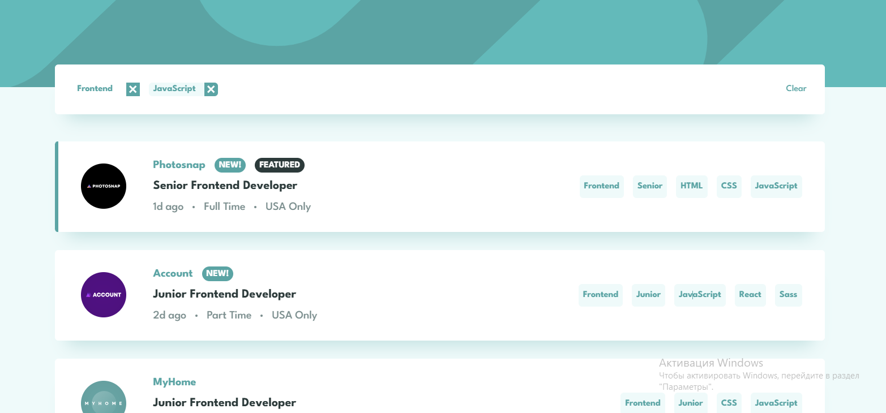

# Frontend Mentor - Job listings with filtering solution

This is a solution to the [Job listings with filtering challenge on Frontend Mentor](https://www.frontendmentor.io/challenges/job-listings-with-filtering-ivstIPCt). Frontend Mentor challenges help you improve your coding skills by building realistic projects.

## Overview

### The challenge

Users should be able to:

- View the optimal layout for the site depending on their device's screen size
- See hover states for all interactive elements on the page
- Filter job listings based on the categories

### Screenshot

### Links

- Solution URL: [Add solution URL here](https://github.com/InnaTymoshenko/static-job-listings)
- Live Site URL: [Add live site URL here](https://static-job-listings-alpha-wine.vercel.app/)

## My process

### Built with

- Semantic HTML5 markup
- CSS custom properties
- Flexbox
- Typescript
- TailwindCSS
- [React](https://reactjs.org/) - JS library
- [Next.js](https://nextjs.org/) - React framework

## Author

- Website - [Tymoshenko Inna](https://itymoshenko.vercel.app/)
- Frontend Mentor - [@InnaTymoshenko](https://www.frontendmentor.io/profile/InnaTymoshenko)
